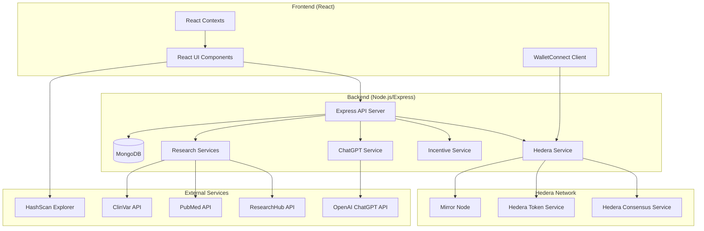
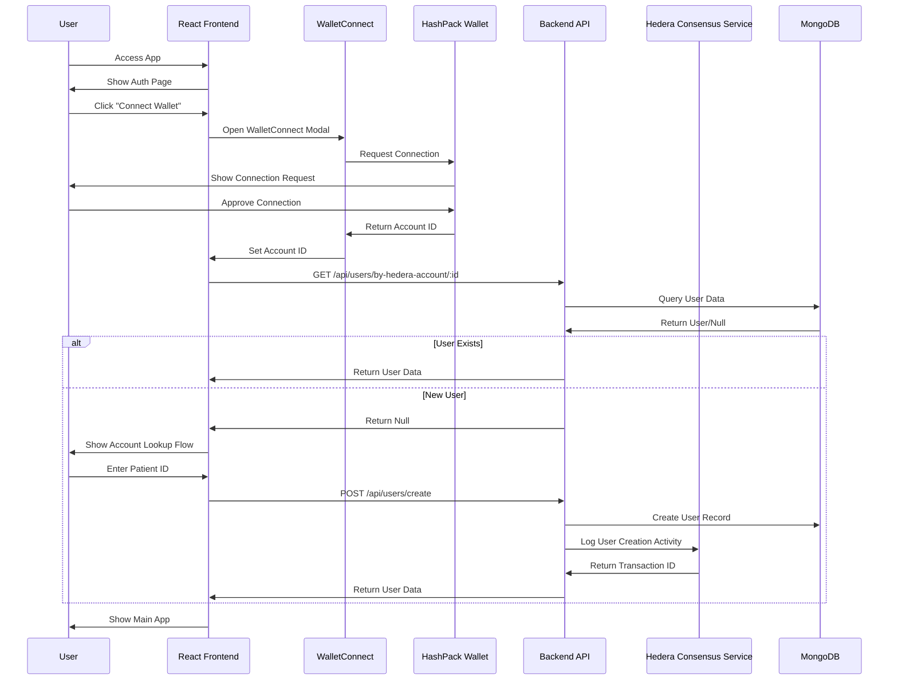
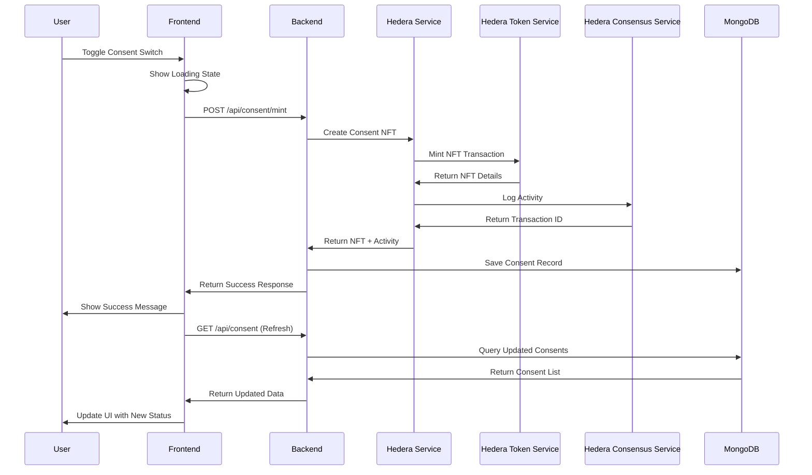
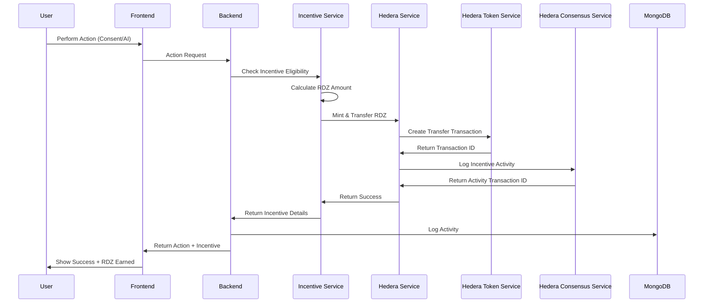
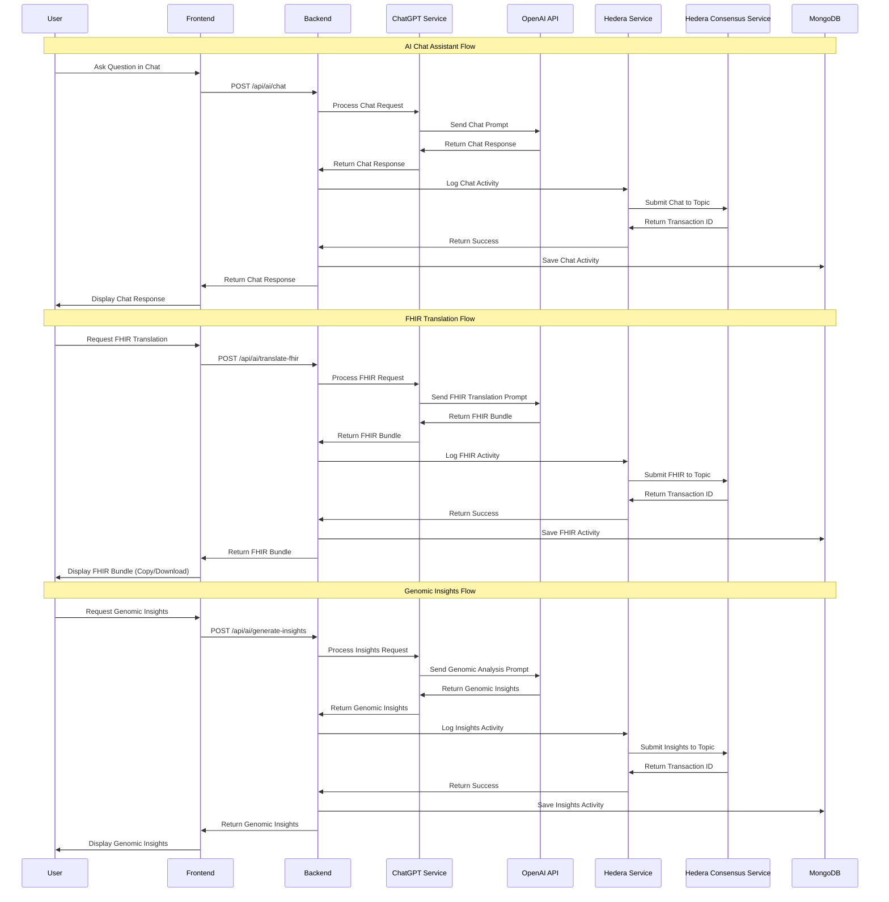
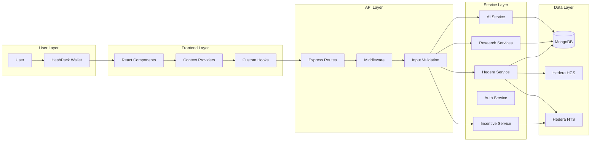
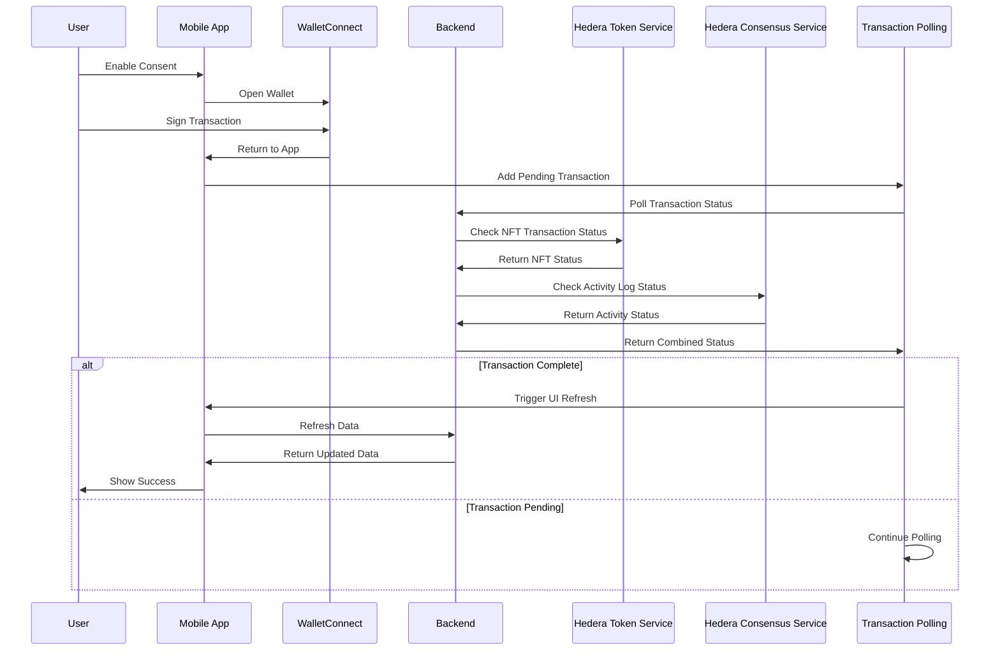
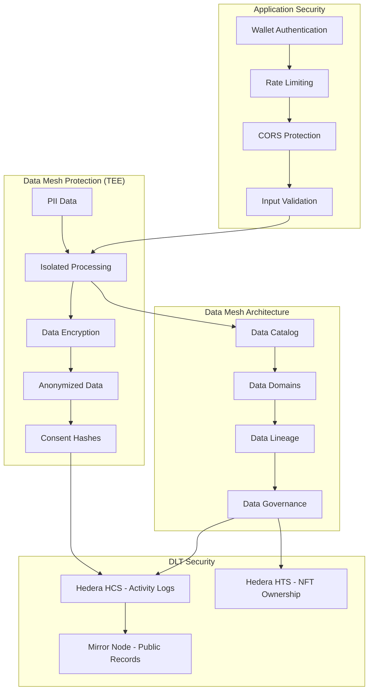
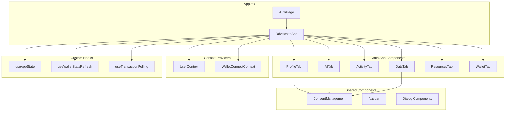
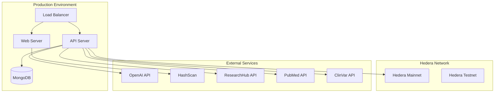

# RDZ Health App - Architecture & Flow Diagrams

## 1. System Architecture Overview

## 2. User Authentication Flow

## 3. Consent Management Flow

## 4. Incentive System Flow

## 5. AI Features Flow

## 6. Data Flow Architecture

## 7. Mobile App State Management Flow

## 8. Security & Privacy Flow

## 9. Component Architecture

## 10. Deployment Architecture

## How to Use These Diagrams

1. **Copy the Mermaid code** from any diagram above
2. **Paste it into**:
   - GitHub/GitLab markdown files (renders automatically)
   - [Mermaid Live Editor](https://mermaid.live/)
   - VS Code with Mermaid extension
   - Notion, Confluence, or other tools that support Mermaid

3. **Customize** the diagrams by modifying the Mermaid syntax to match your specific needs

## Key Architecture Principles

- **Decentralized Identity**: Users control their data through wallet authentication
- **Immutable Logging**: All activities logged on Hedera HCS
- **Tokenized Consents**: NFTs represent user consent with ownership proof
- **Incentive Alignment**: RDZ tokens reward user participation
- **Privacy by Design**: PII never stored on-chain, only consent hashes
- **Mobile-First**: Optimized for mobile wallet interactions
- **TEE-like Processing**: Sensitive data processed in controlled, isolated environments
- **Data Mesh Governance**: Decentralized data management with lineage tracking

## Security & Privacy Features

### Data Protection (TEE-like Approach)
- **Isolated Processing**: Sensitive genomic data processed in controlled, isolated environments
- **Data Encryption**: Genomic data encrypted in transit and at rest
- **Anonymization**: PII removed before any DLT interaction
- **Consent Hashes**: Only cryptographic hashes stored on-chain, never raw data

### Data Mesh Architecture
- **Data Catalog**: Centralized metadata and schema registry for genomic data
- **Data Domains**: Organized data ownership by functional domains (consent, genomic, AI)
- **Data Lineage**: Complete tracking of data transformations and usage
- **Data Governance**: Policies and rules governing data access and usage

### DLT Security
- **Immutable Logs**: All activities logged on Hedera HCS for audit trail
- **NFT Ownership**: Consent ownership proven through Hedera HTS
- **Public Verification**: Mirror node provides transparent transaction history

### Application Security
- **Wallet Authentication**: Users control access through their Hedera wallet
- **Rate Limiting**: Prevents abuse and ensures system stability
- **Input Validation**: All user inputs validated before processing
- **CORS Protection**: Cross-origin requests properly configured

## AI Features Breakdown

### 1. Chat Assistant
- **Purpose**: Interactive Q&A about genomic data and health
- **Input**: User questions about their genomic data
- **Processing**: ChatGPT analyzes genomic data and provides personalized responses
- **Output**: Conversational responses with health insights
- **Incentive**: 10 RDZ tokens per chat session
- **Logging**: All conversations logged to Hedera HCS

### 2. FHIR Translation
- **Purpose**: Convert genomic data to FHIR R4 standard format
- **Input**: User's genomic data from the system
- **Processing**: ChatGPT structures data according to FHIR R4 specifications
- **Output**: FHIR Bundle with Patient, Observation, and DiagnosticReport resources
- **Features**: Copy to clipboard, download as JSON
- **Incentive**: 50 RDZ tokens per FHIR translation
- **Logging**: FHIR generation logged to Hedera HCS

### 3. Genomic Insights
- **Purpose**: Generate personalized genomic analysis and recommendations
- **Input**: User's complete genomic profile
- **Processing**: ChatGPT analyzes variants, phenotypes, and health markers
- **Output**: Comprehensive insights including:
  - Risk assessments
  - Drug response predictions
  - Lifestyle recommendations
  - Genetic trait analysis
- **Incentive**: 25 RDZ tokens per insights generation
- **Logging**: Insights generation logged to Hedera HCS

### AI Integration Benefits
- **Personalized Healthcare**: AI-powered insights based on individual genomic data
- **Interoperability**: FHIR R4 standard ensures compatibility with healthcare systems
- **Transparency**: All AI interactions logged on ledger for audit trail
- **Incentivized Usage**: RDZ tokens reward user engagement with AI features
- **Privacy-Preserving**: Genomic data processed securely without permanent storage

## Research Resources Integration

### 1. ResearchHub Integration
- **Purpose**: Automatically search for relevant research papers based on patient condition
- **Input**: Patient condition from genomic data
- **Processing**: ResearchHub API search for condition-related papers
- **Output**: List of research papers with title, authors, DOI, citations, and publication date
- **Features**: 
  - Automatic search on condition availability
  - Direct links to ResearchHub paper pages
  - Citation count and publication date display
- **Styling**: Purple-themed cards (#3F37C9) with consistent card format

### 2. PubMed Integration
- **Purpose**: Access peer-reviewed research articles from PubMed database
- **Input**: Genetic variants and condition data from genomic profile
- **Processing**: PubMed API search based on genetic findings and condition
- **Output**: Research articles with relevance scores, abstracts, and metadata
- **Features**:
  - Relevance scoring (1-10 scale)
  - Abstract previews
  - Search type categorization (treatment, clinical trial, gene therapy, etc.)
  - Direct links to PubMed articles with PMID
- **Styling**: Green-themed cards (#2E7D32) matching ResearchHub card format
- **Integration**: Articles fetched when user generates ClinVar insights

### 3. ClinVar Integration
- **Purpose**: Genetic variant analysis with clinical significance data
- **Input**: Genetic variants from patient genomic data
- **Processing**: ClinVar API query for variant clinical significance
- **Output**: 
  - Variant clinical significance (pathogenic, likely pathogenic, VUS, etc.)
  - Disease associations
  - Review status
  - Population frequency data
- **Features**:
  - Automatic variant matching
  - African population-specific data
  - Summary statistics and insights
- **Integration**: Variants analyzed when user generates insights

### 4. Unified Resource Display
- **Consistent Card Format**: All research sources use the same card design with source-specific colors
- **Organization**: Resources tab organizes all research by source
- **Priority Order**: 
  1. ResearchHub (top) - Purple theme
  2. PubMed Articles - Green theme
  3. ClinVar Variants - Summary display
  4. African Population Data - When available
- **User Experience**: 
  - Automatic updates when condition data is available
  - Loading states during API calls
  - Error handling and fallback messages
  - Direct navigation from AI tab to Resources

### Research Integration Benefits
- **Comprehensive Research Access**: Single location for all research resources
- **Automatic Discovery**: Research automatically found based on patient condition
- **Consistent UX**: Unified card format across all research sources
- **Source Identification**: Color-coded cards for easy source identification
- **Evidence-Based Insights**: Access to latest research to inform healthcare decisions
